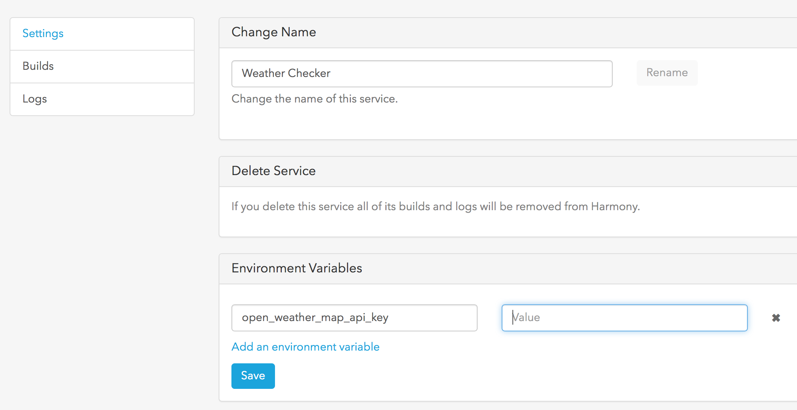
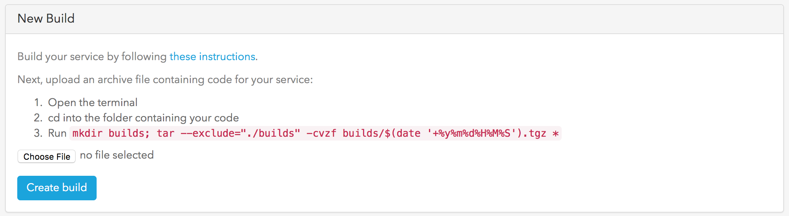
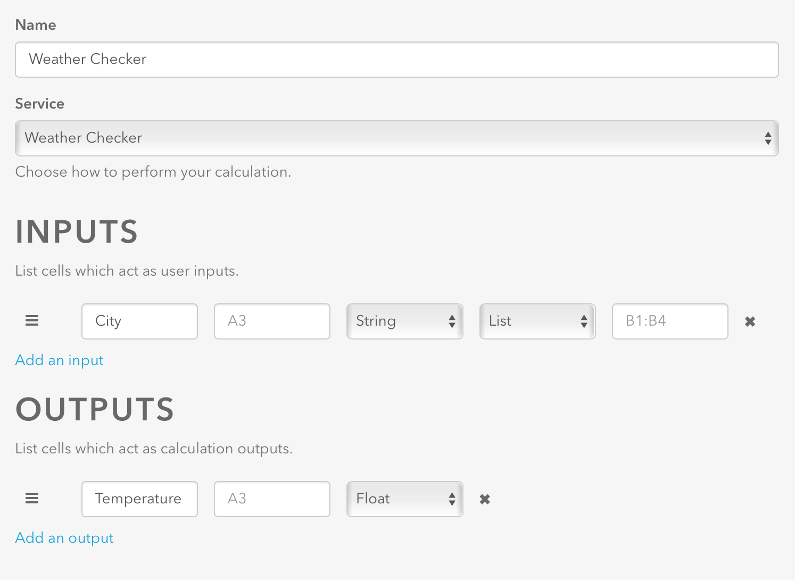

# Harmony::Service

The Harmony Service gem simplifies creation of a micro-service (Service) in the Harmony Platform.

You can connect your Service to pages and Apps inside Harmony. Whenever a page or App connected to your service is triggered it will route a message through to your service with a representative class. You should respond with the appropriate class encapsulating any data you want to display. For example, if your Service recieves a ``Harmony::Service::Chart::Request``, it should return a ``Harmony::Service::Chart::Response``.

You can find the relevant mappings [here](https://github.com/HarmonyMobile/harmony-service/blob/master/lib/harmony/service/rpc_service.rb#L95). 

## Installation

1. Create a new Service via the Harmony platform
2. Download the [Harmony Service Template](https://github.com/HarmonyMobile/harmony-service-template).
3. Add your own code. You will need to use your own source code control.

## Usage

In order to test your code locally you can run `bundle exec rspec`. Once you have completed development you can upload into  Harmony Platform.

The service has 9 request models at the moment, namely..

| Model       | Purpose                                  |
| ----------- | ---------------------------------------- |
| Action List | Provide a list of purchase order items for approval or rejection |
| Calculator  | Turn a loan calculation spreadsheet into an optimised mobile app |
| Chart       | Display Data and various other chart types |
| Document    | Product briefs, presentations, and other documents for the app |
| Capture     | Capture documents or evidence            |
| Instruction | Text and Images to help use the app      |
| Video       | Stream viedos and content                |
| Webpage     | Embed a company webpage or URL           |
| Form        | Create forms to document and photograph health and safety incidents |

For the first integration use case, let's walk through the creation of a simple *Harmony Calculator* based service. For this we will be cloning the [Harmony Service Weather](https://github.com/HarmonyMobile/harmony-service-weather) example and integrate it with the Harmony environment. you can use the documentation present in that repository to understand how the service works. 

Go to *OpenWeatherMap.org*  and get a free API key, follow instructions on how to setup the service on the Harmony service plugin that incorporates this feature. From the documentation presented we examine the service 

```ruby
def work_with_request(request)
  case request
  when Harmony::Service::Calculator::Request
    if request.inputs && request.inputs.include?('city') && request.outputs.include?('temperature')
      city = request.inputs['city']
      weather = weather_service.current_temperature(city)
      Harmony::Service::Calculator::Response.new({outputs: {temperature: weather}})          
    else
      Harmony::Service::Calculator::Response.new({outputs: {city: ['London','New York,US','Bangalore']}})
    end
  end
end

private
def weather_service
  @weather_service ||= WeatherService.new(ENV['open_weather_map_api_key'])
end
```

From the above service code we can notice that we request the service setup for two kinds of interaction, first being the standard use case of passing *City* as an input and expecting *Temperature* as an output. Most of the straight forward query integrations would do well with the *Calculator* request model

The interface gives us access to `:uri, :inputs, :outputs` that can be passed in as a ***Request***, while the ***Response*** channel gives us `:outputs`. The service invokes the *work_with_request* function, which as you can see hooks up to the weather service by passing the `city` parameter to it. if there are no inputs the service will respond with the ideal inputs. Once the service has been prepared and automated tests have been installed, let's prepare the service for apps on Harmony.

1. Log into www.harmonyplatform.io 

2. Click on *Services*, select *+New* 

3. Choose **Custom**, Create service

4. Under **New Custom Service**, Choose a name - let's call it *Weather Checker*

5. Leave the permission type as-is

6. Create an environment variable `open_weather_api_key` to be used by the service and populate it with the one obtained from the website. this populates *config/application.yml* via Figaro o be 

   

7. In the repository folder, run the packaging command as indicated in the build box, to generate a compressed image in the *builds* folder. select *Choose file* and pick the said file.

   

8. Click on *Create build*, which triggers an upload. wait for the status to say Build succeeded. this should take a few minutes. 

9. Click on ***Apps***, on the main navigation bar, and selected *+New*, Enter a name

10. Select *Add a Page*, and choose *Calculator*

11. In Inputs type *City* and in Outputs type *Temperature*, this must correspond to what the service recieves as per the code above. select the service that we just setup, the names don't have to match.

    

12. Choose ***Save & Test***, You shold be able to get a result from the service here

13. Now enter *Harmony App* and test out the same and see if the output matches

Once you get it working, this can serve as a template to modify and integrate your own services, and extend this to include multiple inputs, mutiple services and several pages to suit your business needs.

## License

The gem is available as open source under the terms of the [MIT License](http://opensource.org/licenses/MIT).
